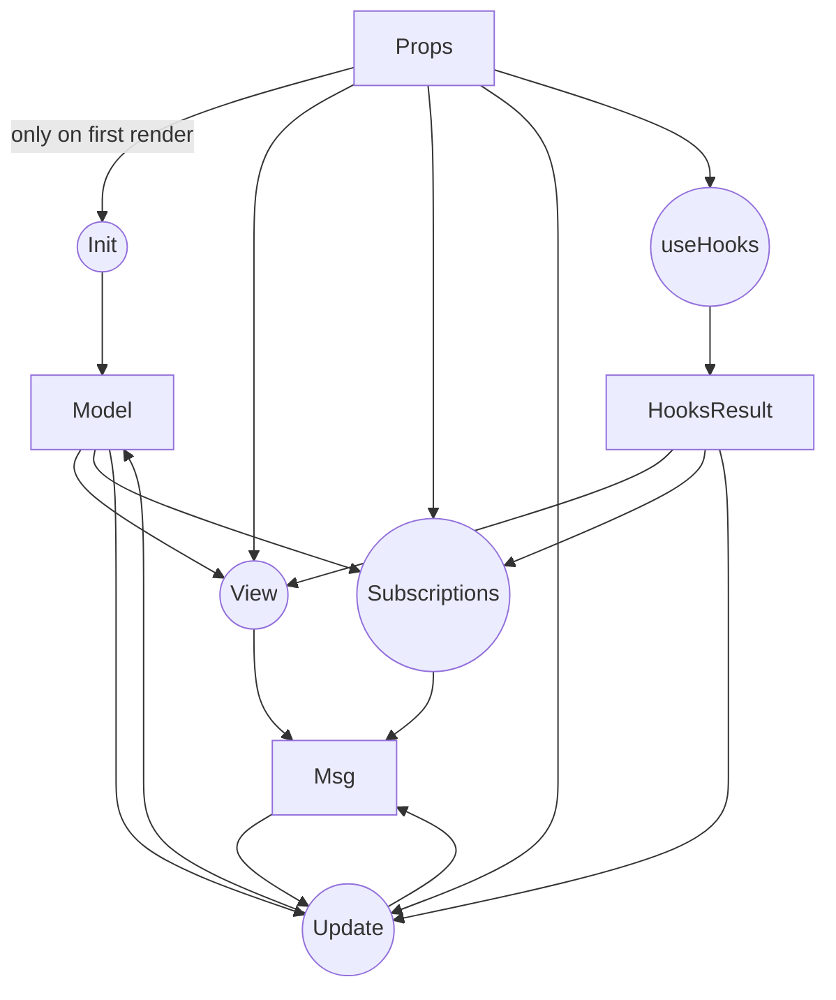

# Data Flow Diagram

```mermaid
graph TD
    p[Props]
    i((Init))
    m[Model]
    msg[Msg]
    h((useHooks))
    H[HooksResult]
    u((Update))
    v((View))
    s((Subscriptions))

    p -- only on first render --> i
    p --> v & s & u & h
    i --> m
    m --> v & s & u
    h --> H --> v & s & u
    v & s --> msg
    msg --> u
    u --> msg & m
```
