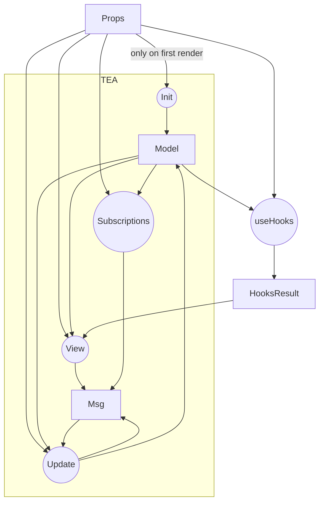

# Data Flow Diagram

```mermaid
graph TD
    p[Props]
    h((useHooks))
    H[HooksResult]

    p -- only on first render --> i
    p --> v & s & u & h
    i --> m
    m --> h

    subgraph TEA
        i((Init))
        m[Model]
        msg[Msg]
        u((Update))
        v((View))
        s((Subscriptions))

        u --> msg & m
        m --> v & s & u
        v & s --> msg
        msg --> u
    end

    h --> H --> v
```
